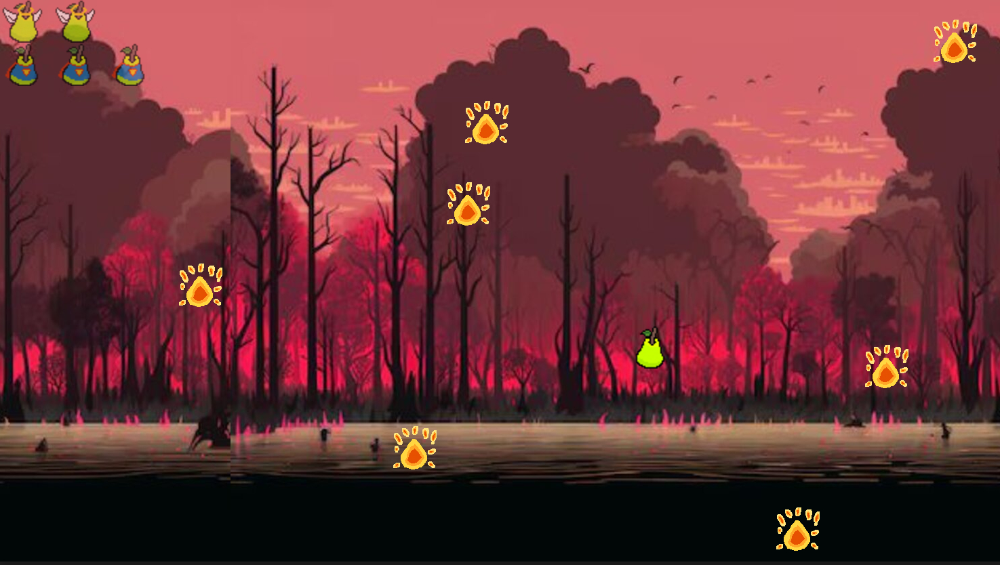
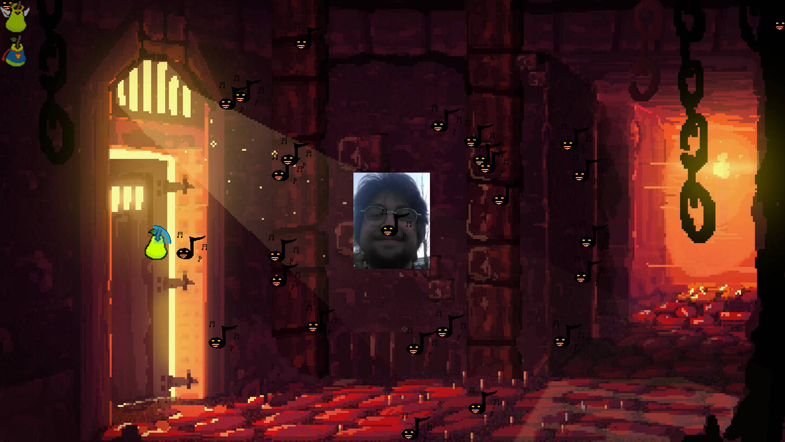

# 🍐 Oh Pera! — Bullet Hell 2D

Un juego tipo *bullet hell* desarrollado en Python usando Pygame, con animación Pixel Art, donde el jugador encarna una pera, la cual debe esquivar oleadas de enemigos calientes y proyectiles afinados mientras avanza en la historia y desbloquea logros.

---

## 🎮 Gameplay

* Movimiento ágil del jugador
* Enemigos con patrones de ataque y seguimiento
* Logros desbloqueables
* Distintas dificultades
* Música y efectos de sonido originales, sincronizados con los enemigos

---
## 🖼️ Screenshots

 
 

---


## 🚀 Cómo jugar

### Opción 1 — Ejecutable (recomendado)

Descargar desde la sección Releases:
👉 *[link]https://github.com/Igo3003/Oh-Pera-El-Videojuego/releases*

1. Descargar el `.zip`
2. Extraer
3. Ejecutar `OhPera.exe`

---

### Opción 2 — Desde el código

#### Requisitos

* Python 3.11 o superior

#### Instalación

* Ejecutar el archivo installer.bat

#### Ejecutar

* Ejecutar el archivo OhPera.bat

---

## 🧠 Estructura del proyecto

```
Oh_Pera!_El_VideoJuego/
├── assets/        # Sprites, audio
├── data/          # Archivos generados (logros)
├── src/           # Código fuente
├── requirements.txt
└── README.md
```

---

## 🛠️ Tecnologías utilizadas

* Python
* Pygame
* Programación Orientada a Objetos (POO)

---

## 📌 Características técnicas

* Organización modular del código (`src/`)
* Separación de assets y lógica
* Manejo de rutas independiente del entorno (compatible con ejecutable)
* Sistema de logros persistente (`data/logros.txt`)
* Sistema de habilidades de jugador
* Manejo de enemigos

---

## 📈 Posibles mejoras

* Manejo del tamaño de pantalla
* Botón para salir del juego
* Elección de controles
* Sistema de Checkpoints 
* Mejoras estéticas en los botones
* Música en el apartado de pausa

---

## 👤 Autor

José Ignacio Paramio

---

## 📄 Licencia

Este proyecto es de uso educativo y personal.
